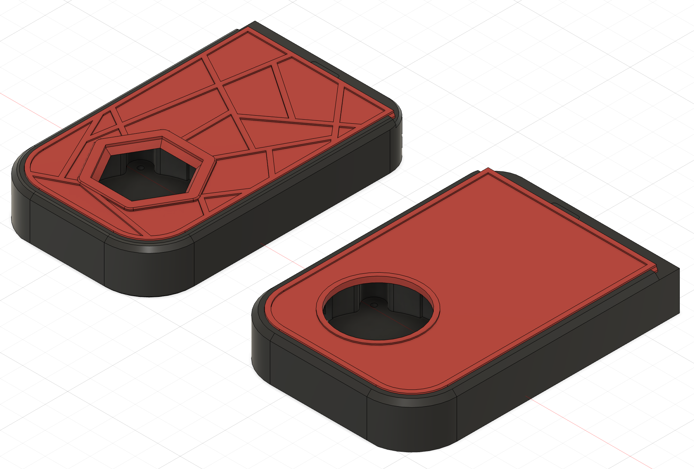

# The Filter - Micron+ Edition

This is a modification of The Filter single fan edition to better fit the Micron+ 3D printer.

The changes optimize fan hole placement, reduce plastic required and improve printing.

## Modifications

* Widen The Filter to 83mm.
* Better alignment of the fan hole.
* Switch the fan hole from hexagon to circular.
* Remove the top pattern on the lid.
* Increase the space for carbon filtration.

## Possible improvements

* Adjust the magnetic mounting position. With this mod, the magnetic mount does not work.
* Increase the back exhaust holes.
* Center align the fan.

## Compatibility

Modified from: [Source Repository](https://github.com/nateb16/VoronUsers/tree/master/printer_mods/nateb16/THE_FILTER/THE_FILTER_SINGLE_FAN)
